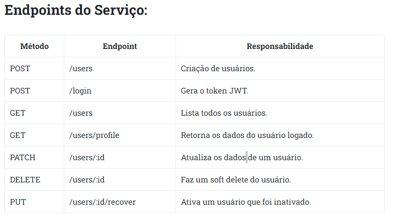

# CRUD de Usuário + Permissão de Administrador
Esse projeto visa desenvolver um CRUD de usuários, com permissões de administrador, utilizando uma API Restful e banco de dados PostgreSQL, o serviço permite a criação, atualização, exclusão e listagem de usuários, além de regras de acesso exclusivas para administradores. O objetivo é oferecer uma solução eficiente e segura para a gestão de usuários em um sistema.

#

## Diagramas de entidade relacionamento:


## Iniciando projeto:
Para inciar este projeto, é necessário instalar as dependências, que serão utilizadas nos testes. Portanto utilize o comando abaixo para instalar tais dependências:

```bash
# caso use npm
npm install

# caso use yarn
yarn
```

## Configurando dotenv
**Configure as variáveis de ambiente no seu .env**, passando as credenciais corretas para conectar em seu banco local. Siga o exemplo do arquivo **.env.example**.

## Rodando a aplicação
Com isso feito, para rodar sua aplicação, basta utilizar o comando:
```bash
# caso use npm
npm run dev

# caso use yarn
yarn dev
```

#

## 🚀 Tecnologias Utilizadas
<ul>
    <li>NodeJS</li>
    <li>TypeScript</li>
    <li>Express</li>
    <li>BcryptJS</li>
    <li>Json Web Token</li>
    <li>PG</li>
    <li>Zod (para validação de dados)</li>
    <li>Dotenv</li>
</ul>

#
## ⚙ Funcionalidades
<ul>
    <li>Criação de usuários.</li>
    <li>Login e autenticação JWT.</li>
    <li>Listar todos os usuários</li>
    <li>Atualizar dados do usuário</li>
    <li>Soft delete de um usuário</li>
    <li>Criptografia de senha.</li>
    <li>Serialização de dados</li>
</ul>

#
## Endpoints do serviço:

### POST - /users
<ul>
  <li>Rota para criação de usuário com os seguintes dados:</li>
  <li>name: string </li>
  <li>email: string </li>
  <li>password: Deverá receber uma string mas armazenar uma hash gerada com o bcrypt</li>
  <li>admin: Não obrigatório, por padrão será falso</li>
</ul>

### POST - /login
<ul>
  <li>email: string </li>
  <li>password: string</li>
</ul>

### GET - /users
<ul>
    <li>Rota lista todos os usuários da aplicação</li>
</ul>

### GET - /users/profile
<ul>
    <li>Rota retorna todos os dados do usuário logado (deve ser passado o token de autenticação)</li>
</ul>

### PATCH - /users/id
<ul>
    <li>Rota para atualizar todos os dados do usuário (deve ser passado o token de autenticação)</li>
</ul>

### DELETE - /users/id
<ul>
    <li>Rota para fazer um soft delete do usuário</li>
</ul>

### PUT - /users/id/recover
<ul>
    <li>Rota de recuperação de usuário que foi deletado</li>
</ul>


# Todos endpoints do serviço:



#

<a href="https://www.linkedin.com/in/hericlessouza/" target="_blank"></a>
  <a href="mailto:hericlessouza01@gmail.com" target="_blank"></a>
  <a href="https://wa.me/5511961383545" target="_blank"></a>
  <a href="https://portfolio-murex-six-65.vercel.app/" target="_blank"></a>
